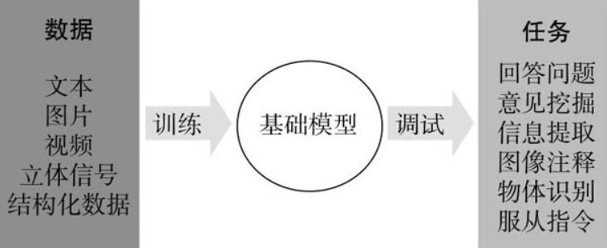
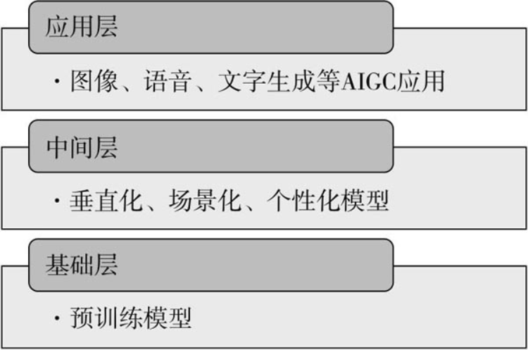
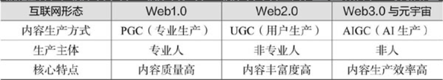
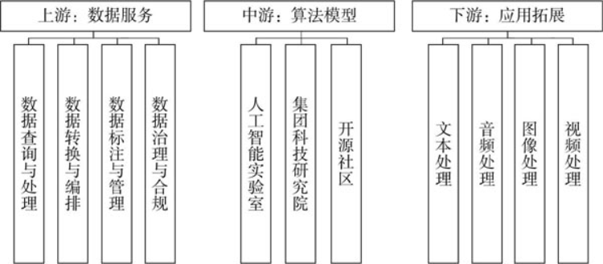

### 序

- Transformer推动了AI整个范式的转变

- 数据、算法、算力是人工智能的稳定三要素

- AIGC产业生态

### C1 AIGC：内容生产力的大变革

PGC to UGC to AIGC

#### 智能创作时代，创作者生产力的提升主要表现为3个方面：

- 代替重复环节，提升创作效率

- 将创意与创作分离，内容创作者可以从人工智能的生成作品中找寻灵感与思路

- 综合海量预训练的数据和模型中引入的随机性，有利于拓展创新的边界，创作者可以生产出过去无法想出的杰出创意

### C2 AIGC的技术思想

#### “图灵测试”引发人们思考：机器能思考吗？什么样的机器才是具备智能的？

#### 人工智能诞生后的发展流派

- 符号主义

	- 认为人的智能来自逻辑推理，世界上所有信息都可以抽象为各种符号，而人类的认知过程可以看作运用逻辑规则操作这些符号的过程

- 联结主义

	- 认为让机器模拟人类智能的关键不是去想办法实现跟思考有关的功能，而是应该模仿人脑的结构

- 行为主义

	- 倡导“感知+行动”，起源于控制论，强调模拟人在控制过程中的智能行为和动作

#### 机器学习

- 计算机程序能从经验E中学习，以解决某一任务T，并通过性能度量P，能够测定在解决T时机器在学习E后的表现提升

- 训练：1. 数据获取 2. 特征工程 3. 模型训练 4. 评估与应用

#### 强化学习

- 让智能体学习在给定的数据环境下，如何选择一系列行动来达成长期累计收益最大化的目标

- 有奖励反馈，为了学到好的策略

#### GAN

- 综合了深度学习和强化学习的思想，通过一个生成器和一个判别器的相互对抗，来实现图像或文字等元素的生成过程

#### Diffusion模型

- 在图像上添加噪声及反转

#### 大模型的重要基建：Transformer

- Seq2Seq模型

	- 编码器会先对输入的序列进行处理，然后将处理后的结果发送给解码器，转化成我们想要的向量输出

- 注意力机制

	- 在理解图片或文本时，大脑会赋予高认知内容高权重

	- 同样是编码器-解码器结构

#### ChatGPT

- 训练过程：1. 收集示范数据并训练一个监督学习的策略 2. 收集对比数据并训练一个建立模型 3. 使用强化学习算法优化针对奖励模型的策略

### C3 AIGC的职能应用

#### AIGC与产品研发

- 智能辅助编程

- 智能应用生成

- 智能文档注释

- 智能测试纠正

#### AIGC与市场营销

- 智能创意营销

- 智能销售流程

	- 建立潜在客户名单

	- 智能客户触达

	- 定制化生成客户解决方案，提高客户转化率

- 智能客户服务

#### AIGC与管理协作

- 智能行政助理

- 智能内部沟通

- 智能团队协作

- 智能人力资源管理

### C4 AIGC的行业应用

#### 资讯

- 辅助信息搜集

	- 科大讯飞的AI转写工具

- 支持资讯生成

	- 写稿机器人、“人民网-百度·文心”大模型

- 助力内容分发

	- 虚拟人，数字人主播

#### 影视

- 协助剧本写作

	- 需要AI公司贴合具体应用场景，对模型做高度针对性的训练，并结合实际业务中的需求进行定制功能开发

	- 海马轻帆的AI训练集超过了50万个剧本

- 推动创意落地

	- 帮助影视工作者从大量重复琐碎的工作中解放出来，从而提高效率，专注于创意的表达

	- AI换脸及返老还童

#### 电商

- 改善用户体验

	- 生成商品的三维模型

- 产品拍摄降本增效

- 活化虚拟主播

#### 教育

- 携手学习者

- 赋能教育者

#### 金融

- 智慧客服

- 智慧顾问

#### 医疗

- AI预问诊，智能用药咨询和提醒，聊天机器人辅助心理咨询，辅助沟通

### C5 AIGC产业地图

### 上游数据服务产业

- 数据查询与处理

	- Data Lakehouse湖仓一体

- 数据转换与编排

	- 提取，加载，转换

- 数据标注与管理

	- 如同备课环节，把原始数据进行结构化处理后，组织整理知识点，教给机器

- 数据治理与合规

	- 安保使合法合规

### 中游算法模型产业

- 人工智能实验室

	- 独立型

		- OpenAI

	- 附属型

		- DeepMind Google旗下

		- FAIR Meta旗下

- 集团科技研究院

	- 阿里巴巴达摩院

	- 微软亚洲研究院

- 开源社区

	- 综合型

		- GitHub

	- 垂直型

		- Hugging Face

		- Papers with Code

### 下游应用拓展产业

- 文本处理

- 音频处理

- 图像处理

- 视频处理

## C6 AIGC的未来

### AIGC时代的参与主体

- 创业者

	- 相较于针对C端用户，AIGC在B端服务方面的变现模式反而更具有可行性，因为传统产业迫切需要AIGC技术来实现降本增效，付费意愿强烈

- 投资人

	- 需要将AIGC的生意本质和产业环境相结合，从用户、生意、市场最佳组合的多维视角，综合评估AIGC产品在所处环境中的价值

- 政府

	- 审时

		- 审地方产业发展阶段之时，度地方发展之势。没有产业基础，科技发展就是无本之木

	- 守道

		- 顺应地方的禀赋，规范发展方向

	- 优术

		- 优化AIGC产业鼓励政策