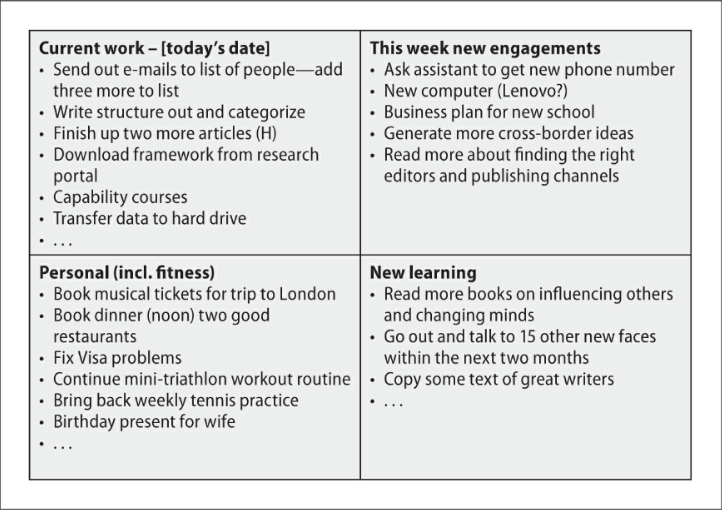
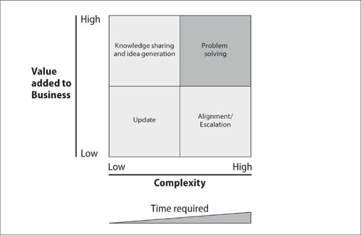
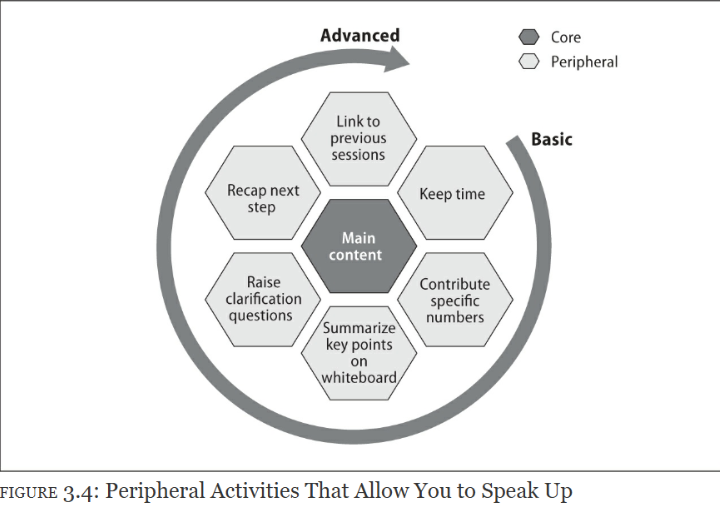

# THE MCKINSEY EDGE

## Chapter 1 塑造更优秀的自我 Get Ahead

### Principle 1 专注于真正重要的事情

- There's a difference between knowing the path and walking the path

- **始终清楚地意识到自己在做什么，以及这些行为是如何为自己或解决自身问题带来价值的。**

- 麦肯锡制作的图表和示意图均采用标准化模板，遵循“一张图表、一个信息、一种格式”的原则，没有任何花哨的设计。这样做的目的是让接收者能够专注于核心内容——即图表所传达的意义；其他任何因素都可能分散他们的注意力。

- 对于咨询行业来说，重要的是要传达的信息及其预期影响

- 对于创业来说，其他事情在初期意义不大，专注于真正重要的事情，才能让你的创业之路更加顺畅。你应该着重于打造公司的核心服务，对其进行测试，并尽可能多地征求他人的意见，对于任何疑虑或不安感，都要勇于面对并加以解决。

- 如何实现聚焦和优先排序？

	- （1）利用紧迫感和截止日期

	- （2）制定或遵循关键路径

		- 决策树decision tree

	- （3）跟钱联系在一起

		- 哪些与收入直接相关

### Principle 2 早上先处理困难的任务

- 早起的时间里，应该把精力集中在需要创造力、创新能力和想象力的工作中，而不是在改变、修理或破坏某物，这些晚上去做

- 从年龄角度来看，你越年轻，就越有可能通过早起并高效完成任务来赢得他人的尊重。

- 然而，有些早晨确实很难集中注意力或开始一天的工作，在这种艰难的时刻，先从阅读开始吧：拿一本书开始看

### Principle 3 捕捉细微的信号并产生影响

- 写下100个形容词描述自己，再从里面选出一个最能概括我们的词：那些能够走上领导岗位的人，对自己有更深刻的认识，明白自己的长处所在，也知道如何进一步提升自己的优势

- 注重与众不同distinctive

	- "与众不同"是最高的评价等级，周围的人都很优秀时，仅靠努力工作无法脱颖而出

		- 捕捉一些微小的线索，由此带来巨大的改变：帕累托分析是一种高效的问题解决方法，20%的投入能够产生80%的成果

			- Case是通过捕捉客户的当下小需求来offer help，赢得好感

### Principle 4 对任何事迅速给出30秒的回应

- 要想迅速给某人留下好印象，尤其是在高层管理者面前，简洁的回答至关重要：对所有问题的三秒回答法则

- 能够条理清晰、迅速地整合大量信息是一种非常难得地能力，整合的内容既不能过于详细，也不能过于笼统或宏观，还要确保听众能够理解

	- 高级管理者能够即时调整沟通的深度和广度

- 试图在极短的时间内传达大量有意义的信息是不现实的。因此，你需要学习一些规则。

	- （1）理解“双击”的原理 double-cliking

		- 某个简短信息足以引起你的兴趣，但远远不足让你了解完全，所以你会点击链接以获取更多的信息

	- （2）剖析核心问题

		- 利益相关者、流程和时间线

	- （3）将回答视为一个靶盘，不是从最内层的靶心开始回答，而是从最外层的环开始

### Principle 5 前置加载项目中的重要部分

- 前置策略：提前规划并优先行动

- （1）尽可能多得与高层领导共度时间

	- 在项目初期与领导多见面绝对有必要，一来有机会提前影响项目的结果、项目安排以及一些细节；二来你会被视为一个非常可靠、能够迅速融入工作并具备快速学习能力的人

- （2）提前想好你的故事结局安排

	- 作为领导者，应该避免让人们去做无关紧要的工作。你不应该要求团队成员花费大量时间制作最终根本用不到的图表，那样会迅速失去他们的信任。为了避免这种情况，要坚守你的工作思路，制定一个时间表，并为团队提供一个包含明确分类的初步计划和实施方案，让他们据此开展工作。

- （3）解决你所有想问的问题

	- 要在一周结束前尽快提出问题，这是唯一“没有风险”的提问时机

	- 利用非正式场合（比如咖啡休息时间）来提出一些敏感的问题

	- 尽量把基于事实的问题放在优先级较低的位置，除非确实有必要立即知道答案

- （4）快速对团队成员进行尽职调查

	- 先联系团队成员曾经共事的人，全面了解他们在项目开始前的优势和发展情况

	- 其次，在第一天与每位成员进行3分钟的单独谈话，目的不是讨论项目内容，而是了解他们的学习需求和动力

	- 在掌握了上述两点之后，应该再安排一次单独的谈话，详细说明项目范围、职责以及需要完成的任务

- （5）组织所有必要的会议

	- 第一周应该用来确定所有需要召开的会议

- （6）将那些你无需处理的工作委托给他人

	- 任何无法真正让你感到精力充沛的事情，都应该先通过一个简单的问题来审视：“这件事能不能由别人来做？”

	- 把所有的注意力都集中在上述（1）-（5）列出的核心任务

	- 如果你被调往一个新的组织，记得在第一周内尽可能地展现自己的能力，这样你建立起来的信任、信誉和信心将是独一无二且难以超越的。不要等到以后；只要有机会，就一定要抓住它。

### Principle 6 打造理想的项目最终成果

- 有一个结局很重要。它带来一种成就感和清晰感。如果没有结局，你仍然会觉得有些事情没有解决。

	- 在一个为期三个月的项目中，这种程度的完成文档早在项目开始的第一周左右就已经在内部流通了，换句话说，麦肯锡会尽可能快地呈现出项目最终的成果形态

## Chapter 1 塑造更优秀的自我 Hang Tight

### Principle 7 在压力之下也要微笑

- 微笑在那些人们最意想不到的时刻尤其有效。

	- 微笑能够减轻压力，带来积极的情绪

### Principle 8 突破你自我认知的极限

- 如果你要抱怨、责备或批评别人，那就采取行动去改变现状吧。

- 主动寻求帮助

	- 拥有一个真诚且关心你的导师非常重要，他们能为你提供正确的视角。主动寻求帮助会让你跳出固有的思维模式，从而找到更好的解决办法

	- 展现出你的脆弱，但也要保持信念。

- 必须停止纠结于过去的失败和未来的不确定性

### Principle 9 始终设想最坏的情况

- 基准情景、最佳情景和最坏情景

	- 投资者很关心公司在最糟糕的情况下仍能表现如何。因此，在日常工作中，你也应该关注如何在情况不利时依然能够取得良好的业绩。

- 明确最坏情况的好处：能更好地控制自己的情绪，保持良好心态；提前准备预防措施

### Principle 10 开始跟进处理

- 跟进工作是一门艺术，其掌握并非一蹴而就。

	- 跟进工作往往不受重视

	- 重新阅读笔记很麻烦

	- 最好做好笔记，把思绪解放出来用于解决问题

		- 因为压力、时间的流逝以及外部因素的影响会导致我们的记忆扭曲现实

		- 有效的跟进工作需要制定相应的规范或编码系统

		- 如果我觉得自己有可能忘记某件事（这种情况经常发生），我会立刻把相关信息记在纸巾上或收据背面

### Principle 11 Push Back with Less Emotion

- 24小时规则：每当在工作中有人要求你做某件不合理的事情时，先等待24小时再做出回应或提出反对意见

## Chapter 1 塑造更优秀的自我 Multiple Reflection

### Principle 12 BE FLEXIBLE ON THE PERCEPTION OF
YOUR PASSION

- 只要你知道是什么让你充满热情，就坚持去做，并不断为之努力

- 重要的是找到那种能让你在早晨感到快乐和充满活力的东西。

	- 如马斯克，他的热情可能源于那些最根本的、最具普遍性的概念，以及构建新事物的过程

### Principle 13 “WHAT WOULD MARVIN DO?” 找到你的榜样 

- 麦肯锡的咨询师们有一句口头禅：“马文会怎么做？”这里的“马文”指的是该公司的创始董事总经理——已故的马文·鲍尔（Marvin Bower，1903-2003），他奠定了麦肯锡的价值观，并影响了现代管理咨询行业的实践方式。

- 心中有一个榜样，其作用不仅限于处理敏感话题。它还会对诸多方面产生积极影响，包括与团队成员的沟通、与客户的交流以及与上级的对话。

- 人类往往倾向于以狭隘的角度来看待事物。榜样能帮助你摆脱这种狭隘的思维模式，从而看到全局。试着为不同的场合设定不同的榜样，而不是采用“一种模式适用于所有情况”的做法。

- You should have at least a dozen people in your role model Hall of Fame.

### Principle 14 了解在一天中哪些事情能让你获得最大的能量

- 有一种核心理念能够区分出有潜力的成功领导者与平庸之辈：所有优秀的领导者都懂得如何合理利用时间，并有效释放压力

- 度假这种缓解即时压力的办法不是长久之计，要认识到这一点，并致力于参与那些能真正帮助你减轻工作压力和疲劳的活动

### Principle 15 去慢跑，感受大自然的美好

- 慢跑和其他形式的“独处”运动能帮助你清晰地梳理思绪，明确自己的首要任务。

### Principle 16 制定承诺计划

- 包括长期愿景、中期目标和短期目标。这个计划能很好地提醒我们树立高远的志向

- 承诺计划有三个重要作用：其一，它能让你变得更加积极主动、以成就为导向；其二，你可以逐年衡量自己的进步情况（根据实际情况调整目标），同时具备责任感；其三，它会让你开始相信自己能够实现任何目标。

- 要走领导发展之路，就需要制定并执行属于自己的承诺计划。在这个过程中，你肯定能发现自己目前所欠缺的东西。

## Chapter 2 Growing with Others 与他人共同成长 Understanding

### Principle 29 有意识地评估你的团队成员

- 四个需要牢记的核心问题：

	- 你是否在要求团队成员做正确的事情？

	- 你在描述最终输出结果/交付成果时是否足够谨慎和清晰？

	- deadline正确吗，会不会太乐观了？

	- 你是否考虑到了所有可能出现的障碍？

- 领导者所能带来的最大价值在于将问题及所需开展的活动分解成易于理解的小部分

### Principle 30 为团队成员分配有意义的任务

- 在布置任务时，有意义的任务应该同时具备独立完成的能力（即不需要他人帮助）和能够获得他人认可的价值

### Principle 31 通过有针对性的在职培训来培养追随者

- 无论在何处担任领导者，要想取得成功，都需要有指导与学习的过程。此外，你希望你的下属能与你秉持相同的价值观。培养这种正确的思维方式需要通过有针对性的辅导来实现。这既具有实用性，也能带来个人成就感。

### Principle 32 运用积极的批评方式提供反馈

- 首先给予表扬，然后传达需要纠正的具体内容，最后再次给予表扬

### Principle 33 善待你的助手和支持人员

- 向人们提供项目的全局视角，而不是采取零散的处理方式

## Chapter 2 Growing with Others 与他人共同成长 Connection

### Principle 23 INSTANTLY FIND A CONNECTION IN THE ROOM

- 正确的沟通情境比内容本身更为重要

- 你必须对结识有趣的人保持好奇心；你可以尝试培养自己的爱好，尤其是那些高层领导者所喜爱的艺术、音乐或手工艺方面的兴趣。旅行时，不妨不仅仅局限于观光，而是积极参与当地的活动，深入体验当地文化。真正重要的是要始终保持这种意识，以便建立起更深层次的亲密关系

### Principle 24 Be a Giver, not a Receiver

- 在向领导角色过渡的过程中，你确实需要成为一个乐于付出、能够营造积极氛围的人。

### Principle 25 发现人们内心的善意

- 要发掘每个人身上的优点，而不是一定每次都去找最适合自己共事的人

### Principle 26 了解团队成员的关键时刻和个人特点

- 当你成长为领导者时，理解他人的意愿、动机和情感就变得更加重要。

### Principle 27 把每个人都视为乐于助人的个体，而非“资源”

- 职位越高，人们就越关注你的行为，而不仅仅是你的领导策略。因此，亲自动手、展现出自己能够深入实际解决问题的能力始终非常重要。主动承担那些繁琐的工作，成为第一个尝试解决难题的人。

- 尽可能让对方觉得只有自己才能完成某件事。最能带来成就感的方式就是让对方感受到自己的特别之处。

- 表达感激之情是最能体现尊重他人的方式

	- 选择合适的时机也很重要。如果可能的话，尽量在最让他们在意的人面前给予表扬。

### Principle 28 每周都和有趣的人一起出去吃饭

## Chapter 2 Growing with Others 与他人共同成长 Communication

### Principle 17 务必记住任何Presentation的前三句话

- 开场白决定了整个演讲的效果

	- 你之所以要记住前三句话，是因为这些句子最能吸引人们的注意力

	- 记住这些句子能让你自己感到更加从容

- 使用较短的句子也能让你展现出更加成熟的领导形象

- 听众的注意力时间很短，演讲者会试图在开场时分享一个有趣的轶事、一句鼓舞人心的引言或令人震惊的研究结果。

	- 吸引听众的最佳方式是通过建立情感联系

### Principle 18 用更少的词语进行沟通

- 用更少的词语与他人交流需要练习。这比乍看之下要困难得多，因为这要求你清晰地组织语言结构、有选择地省略某些细节、谨慎地选用合适的词语，并在描述中尽可能回答对方可能提出的问题。

### Principle 19 在回答难题之前，请暂停三秒钟

- 面对棘手的问题，在回答任何问题之前先稍作停顿

### Principle 20 多提问，少说废话

- 如果能归纳出成功企业家与麦肯锡高管之间的一个显著共性，那就是他们都会更多地提出问题（因此也会更多地倾听），而较少主动发言。

	- 全身心投入其中，乐于倾听，探索未知

### Principle 21 将“不”转化为“是”

- 当客户对市场情况发表了一些明显错误的观点时，我又一次看到他点头表示赞同。他只是耐心地听着，但在表示同意的同时，会巧妙地提出一些引导性问题，比如：“我明白了，不过您有没有考虑过这个想法？”

	- 简而言之，他其实是在表示反对，但他没有直接说出来，而是用问题来回应。

- 在大多数情况下，除非情况紧急，否则你没有必要反驳别人；间接指出对方的错误并让他们自己意识到问题会更好；没有人愿意被否定或被告知自己错了，尤其是在高层场合，因为这会影响到他们的尊严和地位；对话是最常见的交流方式，因此不应该被轻视。在处理潜在的冲突时，你应该格外谨慎

### Principle 22 不要展示未完成（或做得不完善）的结果

- 如果你能确保自己的工作质量，建立良好的声誉就会更容易——因为只有你自己能掌控自己展现给别人的形象。

- 当你被公认为领导者时，人们会期望你始终处于领先地位。你的评价标准是工作成果的质量，而非你投入的工作量。

## Chapter 3 Excelling in Process Management 流程管理方面表现出色

#### 生产力从来都不是偶然产生的。它始终是追求卓越、精心规划以及专注努力的结果

### Principle 34 在会议前务必准备好议程

- 制定议程是一个自上而下的过程，也是一种重要的承诺体现。通常我们不会特别关注议程本身的价值，但它确实是一个关键的优先级设定工具。当你自己制定议程时，就需要格外留意措辞以及所要传达的信息

### Principle 35 创建 four boxes 待办事项

- 当前工作、个人事务、本周新增的工作任务以及需要学习的新内容

### Principle 36 关注结果/交付成果而非活动本身

- 有时，根据你所从事的行业或职能（例如项目管理办公室、采购与供应链运营、零售业务等），你需要认真跟踪所有未解决的问题

### Principle 37 提前了解会议模式

### Principle 38 运用 5D法则 主动管理电子邮件沟通

- “5D原则”：委派（delegate）、删除（delete）、推迟（defer）、简化语言（deword）以及停用相关功能（deactivate）

### Principle 39 尽早表达意见

- 要注重提供全面的观点，而不仅仅是自己的想法。全面的观点能带来新的视角，从而帮助你做出决策，进而创造价值。

- There is another definition of “speaking up” that
means to “raise the issue” at McKinsey. 在这种情况下，它只是表示你不应该等到最后的关键时刻才表达自己对敏感话题的不同意见或看法。

### Principle 40 创建一个极简风格的演示工具包

- 1. 背景、问题和目标是什么？

	- 创建一个“背景、问题与目标”模板，以便为你的任何工作提供背景信息。

	- 在介绍当前情况、存在的复杂问题或简要的背景历史时，以一个有意义的背景作为开场非常重要。

- 2. 我们将带来哪些变化？

	- 现状”与“目标状态”模型，用于展示当前状况及期望的未来状态

- 3. 需要量化的影响有哪些？

	- 数字说明一切

- 4. 需要回答的关键问题是什么？

- 5. 详细工作计划中包含哪些关键的工作坊和会议？

- 6. 提议的项目团队架构是怎么样的？

	- 项目都有相关的利益相关者。通过使用“人员配置”模板提前明确责任和角色，可以协调这些人员的期望

### Principle 41 创建一个易于使用的更新模板

## Chapter 4 Going the Extra Mile 多做一点，超出预期

#### Change before you have to.

#### 只有相信自己的工作成果可以不断迭代改进，才能创造出真正有影响力的成果

### Principle 42 毫不吝惜地传授知识和工具

- 以我的经验来看，当你帮助他人取得成功时，其他人（不一定就是你直接帮助过的人）也会反过来帮助你取得成功

- 当你主动去帮助他人时，你也会学会如何帮助自己取得成功。当然，工作生活中的情况可能没有那么戏剧化。然而，当你开始为他人付出和贡献时，你会陷入深思。

- 关于如何最大化你的奉献行为：当然，你可以首先思考“什么能为人们带来真正的价值？”但同时也要想：“什么既能为我带来价值，又能极大地帮助他人？”这样，你的思想和行动就能保持一致，使你的付出更有意义，提升奉献的质量，最重要的是，能够持续地坚持下去。

### Principle 43 消除physical的障碍

- 要想取得成功，你需要做出一些决策，为自己的生活创造结构性优势，并尽可能避免设置各种物理上的障碍

- TPO: to be at the right time, at the right place, and at the right occasion 恰逢其时，恰逢其地，恰逢其事

- 如果你建立了正确的结构，你就已经离成功更近了一步

### Principle 44 Ask the second order questions 二阶思考

- 尽管你可能会深入探究更多“为什么”的原因，但问题仍然停留在最基本的层面，费时费力

	- 假设你打算采取的行动或要质疑的事情已经发生了，然后问接下来会发生什么

- 要提出有意义且深刻的问题，你必须做到三点：首先，在相关行业或领域积累经验；其次，提高对客户、背景或个人的敏感度；最后，尽快深入到问题的核心层面。

### Principle 45 学会少记笔记

- 减少笔记的记录量其实是一种对大脑进行高强度训练的方法

	- 迫使记住各种信息，专注于当前讨论的内容；有助于清晰地梳理要点；有助于更轻松的向他人传达信息

### Principle 46 准备好重塑自己的生活

- 我们如何定义自己以及如何看待有价值的事物是会不断变化的

### Principle 47 作为领导者，打造属于自己的“个人形象”

- 从麦肯锡咨询师的角度来看，潜在领导者的特质需要从以下四个维度进行评估：
潜在领导者必须具备：

	- 1. 与他人相处时，他们表现得非常出色。这些人拥有惊人的能量，能够激励和鼓舞其他咨询师、客户以及领导者。他们通过自身“卓越的客户服务”品牌影响力来吸引客户，从而培养自己对麦肯锡工作的热情。

	- 2. 解决问题的高手。诸如“创新”、“富有创造力”、“技术领先”以及“具有高附加值”和“思想领袖”之类的词汇，都非常适合用来形容这些人。与此同时，他们也为将公司建设成为未来的问题解决强队奠定了基础和提供了必要的要素。

	- 3. 非常擅长完成任务。他们是真正的执行者，具备扎实的专业能力。客户、顾问和其他同事在遇到特定问题时都会向他们寻求指导。“如果有相关问题，就去找他”，这句话再贴切不过了。

	- 4. 企业家精神（在企业环境中）。他们主动采取行动，利用自身意愿去创造新事物或将现有做法提升到一个新的水平。与真正的企业家一样，他们擅长在有限的资源（包括人力和财力等）条件下进行整合、规划并制定方案。

## Chapter 5 Become a Thinker and a Writer 成为一名思考者和作家

### 我们常常被告知在成长过程中要学习更多知识。虽然这是事实，但真正的乐趣在于深入思考——探究思想、事物和事件的根本层面，并认真对待它们所蕴含的意义和相互关联之处。不断思考、学习，再通过学习来进一步思考，形成一个循环。

### 制定属于自己的成功原则，并将这些理念构建成一个条理清晰、注重质量的体系。这将成为培养你未来领导能力最有效的工具之一。