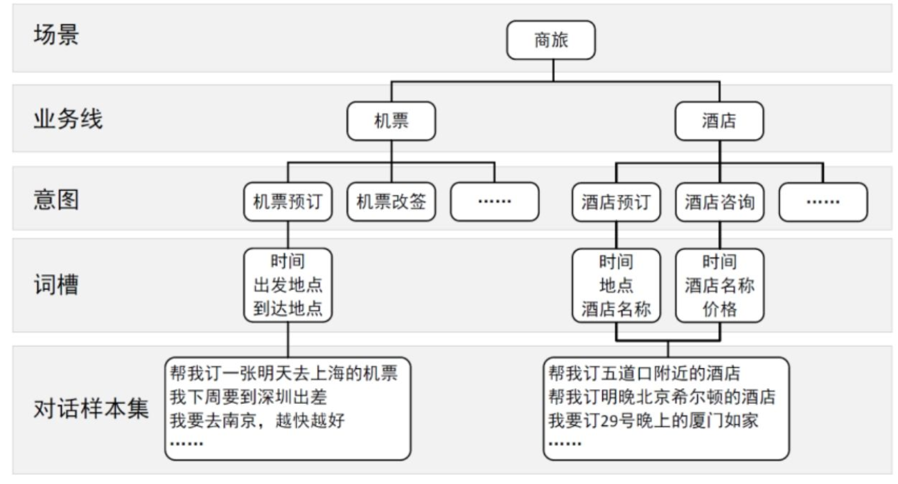

# Chatbot从0到1：对话式交互实践指南

## 一 人工智能时代之骄子

### 人工智能的春天来了

- 微软Build 2016开发者大会上，微软CEO纳德拉首先提出了“对话即平台”(Conversations as a Platform，CaaP)的人工智能发展方向

### 关于这本书

- 维基百科中对Chatbot的定义：

	- Chatbot是经由对话或文字进行交谈的计算机程序

- 作者认为：

	- Chatbot是对话式交互的产品形态

		- 用说话来代替触摸或者鼠标操作计算设备

### Prompt Engineer

- 专注于设计、优化和测试输入提示，以实现更高质量的人工智能与人类的交互，使模型更能满足用户的需求

- 主要职责：

	- 设计有效的输入提示

	- 优化人机交互

		- 使其更具针对性、准确性和实用性

	- 跨领域合作

		- 与数据科学家、产品经理和开发者共同开发和改进人工智能产品

	- 测试与评估

### Chatbot应用场景及分类

- 开放域(Open-domain)问题 （用户基数比较大，问题空间极大，容易传播，目的性弱，内容覆盖范围广泛）

	- 没有太多限定的主题或明确的目标，用户和Chatbot间可以进行各种话题的自由对话

	- 要准备的知识库和模型要复杂得多

- 封闭域(Closed-domain)问题

	- 限定在一定场景之下，有若干明确的目标和限定的知识范围

	- 要求Chatbot能够整合更多的领域知识、用户的基本信息及对上下文语境的分析和判断

	- 是融合商业、产品、运营、数据知识积累和模型调优等方方面面的权衡与综合考量的结果

- 根据应用场景和特点分类：

	- 垂直行业Chatbot

		- 基于特定行业或领域的需求和场景而设计的Chatbot

		- 如医疗健康领域中帮助医生记录病历和问诊，金融领域中提供个性化理财建议，教育领域中提供个性化的辅导和学习建议

	- 智能客服Chatbot

		- 在线客服，自助服务，客户反馈和投诉

	- 工作Chatbot

		- 针对企业内部或者团队的工作流程和任务管理，用于辅助工作的Chatbot

	- 娱乐Chatbot

		- 提供便捷、有趣、交互式的娱乐体验，如游戏Chatbot，音乐Chatbot，电影Chatbot，社交Chatbot

	- 教育Chatbot

		- 学习辅助，测评辅助，教学辅助，信息查询

	- 个人助手Chatbot

		- 日程管理，健康管理，购物，语言学习，社交，旅游，金融

- 行业的典型分类：

	- 闲聊型Chatbot

		- 开放，不限定领域

			- 对话轮次越多越好

				- 应用如儿童故事机，陪聊机器人

	- 任务型Chatbot

		- 有任务目标，需要参数化请求

			- 用最短的对话轮次，满足用户需求

				- 应用如智能助手类、智能会议系统、地图导航、车载系统、儿童故事机

	- 问答型Chatbot

		- 有任务目标，无需参数化请求

			- 用最短的对话轮次，满足用户需求

				- 电话客服类、智能客服类

			- 使用“意图识别+多轮对话+对接企业API+企业知识图谱”的方式回答相关问题

## 二 通用人工智能的春天：引领未来的关键技术

### ChatGPT的介绍及应用场景

## 三 Chatbot的生命周期（上）

### 人机对话的核心

- 意图识别

	- 机器先判断这句话的意图

- 实体提取

	- 机器再通过实体获取这句话的关键词

### Chatbot的生命周期

- 1. 需求分析

	- 一个详细的需求文档

- 2. 流程设计

	- 按钮、操作指令等

- 3. 数据处理

	- 数据收集、数据清洗、数据转换、数据切割、数据更新及扩充

- 4. Prompt撰写

	- 非线性交流，通过Prompt引导大语言模型给出合理的话术

- 5. 系统搭建

	- Chatbot=语音识别+自然语言处理+语音合成(Text to Speech)

- 6. 系统测评

	- 对任务型Chatbot来说，在能完成任务的前提下，对话的轮次越少，说明这个系统越好；而对闲聊型Chatbot来说，一个系统的对话轮次越多，说明这个系统越好

- 7. 平台渠道集成

	- 用户在哪里，Chatbot就集成到哪里

- 8. 运营反馈

	- 不断地尝试对话并优化回答方式，同时开放内测，甚至对部分用户进行测试，以获取真实数据，不断优化

### 检索增强生成RAG (Retrieval Augmented Generation)

- RAG

	- RAG结合了信息检索和文本生成两种方法，旨在突破传统问答系统的局限(依赖固定的数据结构和知识库，限制了系统处理复杂问题的能力发展)

		- 通过将外部数据检索的相关信息输入大语言模型，大语言模型能够基于这些信息生成回答，进而增强答案生成的能力

		- 被视为模型的“外挂数据库”，以优化模型的回复

- Fine-tuning

	- 基于数据调整模型的权重，使其更贴近应用的特殊需求

		- RAG更简单、更便宜，但其产出质量可能不如Fine-tuning

### Chatbot生命周期中的“1. 需求分析”

- 确定Chatbot的边界

	- 场景边界，痛点，核心功能，预期的开发时间和所需资源

	- 由懂业务的产品经理来整理一个完善且逻辑自洽的需求文档

- 确定Chatbot的形象

	- Chatbot的形象和公司的品牌理念、公司形象、产品特征息息相关

	- 快速加强用户与Chatbot情感联系的做法是为Chatbot设置一个简历档案

		- 当Chatbot拥有完全成熟的个性时，用户会喜欢它、信任它，并真正享受与之互动

- “六何”产品需求分析法

	- 何人——目标人群

	- 何因——预期目标

	- 何地——使用场景

	- 何事——产品功能

	- 何时——需求节点

	- 如何——如何实现

### Chatbot生命周期中的“2. 流程设计”

- 在流程分析中要持续思考：用户的目标是什么？他们有什么需求要被满足？每一个流程是否都朝着正确的方向进行？

- 梳理业务要素

	- 在开始某个具体的Chatbot设计之前，产品经理需要业务方提供大量的对话脚本，在收集大量的具体场景的对话草稿之后，才能梳理出主要功能、对话场景边界、需要的数据资源、核心要素、抽取对话流程等信息

		- 首先，确定优先级和关键信息要素

		- 其次，多维度展示状态信息

		- 然后，梳理Chatbot业务要素，即定义变量

		- 最后，说明梳理业务要素时如何定义变量

- 抽取对话流程，绘制流程图(如同用户的导航图)

	- 单通道，泳道图

	- 合并业务线

	

### Chatbot生命周期中的“3. 数据处理”

- 数据收集主要是指收集：

	- 业务数据

	- 对话样本数据：用户的各种说法（聊天数据或者问答数据）

- 数据清洗，去除掉与匹配无关的噪声

- 数据转换，整理数据成便于切割的、格式相对统一且标准化的文本数据

- 数据切割，这一步对RAG的效果影响很大，需要把非常大的外部文件进一步切割成适应模型上下文窗口的较小的文本块，才能精准地进行检索和生成

- 数据扩充，高质量的开源数据很稀缺，但大语言模型可以模拟人类真实对话，只需要编辑好prompt，就能让大语言模型生成相似语料

### Chatbot生命周期中的“4. Prompt撰写”

- Prompt=清晰的任务描述+足够多的样例

- 4种提示工程的方法

	- 1. 给AI工具适当的提示，引导它生成一些有用的输出

	- 2. 尝试多种表达方式，以达到最佳效果

	- 3. 描述一些具体的事情，并给出背景信息

	- 4. 向AI工具展示你希望看到的内容，引导它生成你想要的输出

- CRISPE框架
【基于此框架可进行prompt优化，以修复“无灵魂的写作”和增强文档的可读性】

	- CR：Capacity and Role 能力与角色

		- 你希望ChatGPT扮演怎样的角色

	- I：Insight 洞察力

		- 为ChatGPT提供场景描述、背景信息、上下文

	- S：Statement 指令

		- 你希望ChatGPT做什么

	- P：Personality 个性

		- 你希望ChatGPT以什么语言风格、个性、礼仪习惯回答你

	- E：Experiment 多样本试验

		- 要求ChatGPT为你提供多个答案

- BORE框架

	- B：Background 背景

	- O：Objective 目标

	- R：Key Result 关键结果

	- E：Evolve 试验与改进

- 结构化Prompt的优势

	- 结构清晰，符合表达习惯

	- 语义认知，让人类与大语言模型更好地沟通

	- 企业协作，像代码开发一样构建生产级Prompt

- 思维链 Chain of Thought

	- 尽可能全面地拆解步骤，不忽略重要细节，充分地考虑问题

	- 优势：常识推理能力赶超人类；数学逻辑推理能力大幅提升；大语言模型更具可解释性，更加可信

- Prompt工具介绍

	- FlowGPT

		- 是一个ChatGPT用户的社群，让更多人了解ChatGPT的潜力，发现、分享、讨论并学习最有趣的ChatGPT使用场景

		- 收集和整理了非常有用的ChatGPT提示词和应用场景，可以显著提高日常工作效率和生产率

## 四 Chatbot的生命周期（下）

### Chatbot生命周期中的“5. 系统搭建”

- Chatbot=语音识别+自然语言处理+语音合成

	- 语音识别：将人类的语音中的词汇内容转换为计算机可读的输入

	- 自然语言处理：话术分解、语义分析，并根据分析结果确定适当的操作，以用户能理解的语言回复

	- 语音合成：将任意文字信息实时转化为标准流畅的语音朗读出来

- 自然语言理解

	- 解决如何更好地处理非结构化输入并将其转换为Chatbot可以理解和操作的结构化形式的问题

- 对话管理

	- 控制人机对话的过程，根据对话历史信息决定此刻对用户的反应

- RAG搭建

	- RAG变种之一：RAG-Fusion

- 平台工具介绍

	- LangChain

		- 一个帮助开发者快速搭建大语言模型应用的开源框架

	- AutoGPT

		- 一种agent，为自主完成复杂任务而生，在任务拆分与执行，记忆管理，无法联网和自主性方面都远超传统大语言模型

### Chatbot生命周期中的“6. 系统测评”

- 任务型Chatbot测评指标

	- 任务完成率和平均对话轮数

		- 任务完成率越高越好，平均对话轮数越少越好

	- 最终指标是测评用户的满意度

- 问答型Chatbot测评指标

	- 准确率：正确回答数与所有回答数的比例

	- 召回率：Chatbot能回答的问题除以问题总数

	- 问题解决率：问题总数-转人工客服的数量-客户反馈不满意的问题数量，除以问题总数

- 闲聊型Chatbot测评指标

	- 线上指标

		- 平均对话轮次

		- 用户对Chatbot的直接评价

	- 客观评价

		- 流畅度

		- 与参考答案的相似度

	- 主观评价

		- 包括上下文一致性，是否冒犯用户、参与度、有趣和合适性等

### Chatbot生命周期中的“7. 平台渠道集成”

- 微信

- 钉钉

- Bot Framework

	- 微软推出的供用户制作自己的Chatbot的平台

### Chatbot生命周期中的“8. 运营反馈”

- 通过数据，让Chatbot的设计者深入了解用户的想法和需求，总结出很多Chatbot优化的规律，然后再回到前面的步骤，循环往复

- 流量分析

	- 时长与轮次

	- 会话流量

	- 平台渠道分析

- 对话内容分析

	- 对话聚类

	- 意图统计

	- 消息漏斗

	- 词云分析

	- 情绪分析

	- 让用户为Chatbot评分

	- 转化路径分析

- 对话异常分析

	- 异常对话记录

	- 热门退出消息

	- 调用默认回答的次数

- 用户分析

	- 活跃用户

	- 用户留存率

	- 用户活跃度

	- 用户总数

	- 用户画像

## 五 机器人流程自动化：建立AGI与现实世界的接口

### RPA(Robotic Process Automation)

- 一种利用软件机器人模拟和执行人类在计算机上完成的高度重复性、规律性的任务的技术

- 能够模拟人类再软件应用程序中执行的操作，从而实现业务流程的自动化

### WeChaty SDK

- 一个托管在GitHub上的Chatbot开源项目，可以通过最少6行代码完成开发，帮助开发者实现一个Chatbot

### Wechaty Puppet Provider和Wechaty Puppet云服务

## 六 对话式AI的时代已经到来

## 结论

这本书系统地梳理了对话式交互从理念到落地的全过程，强调了从“以用户为中心”的需求洞察出发，
结合自然语言处理、对话设计和产品思维，将聊天机器人打造为真正能解决问题和提供价值的交互工具。